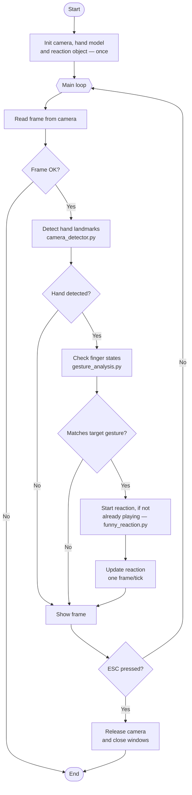

# Computer-Vision-Project ( •.• )
This is a project in which we use Google's MediaPipe hand landmark detection
to detect a hand pose and play a video and audio clip of a meme (the skuba dance).

## Main Features

- **Detection of key points (Landmarks):** Identifies and tracks the 21 points of the hand in real time with high precision.
- **Pose Recognition:** Analyzes finger positions in each video frame to classify a gesture.
- **Interactive Playback:** When the correct pose is detected, a video and audio clip plays automatically.

## Technologies Used

- [Python](https://www.python.org) - Primary language of the project.
- [Git](https://git-scm.com) - Version control system.
- [MediaPipe](https://google.github.io/mediapipe/) - Detection and tracking of key hand points (Hand Landmarker).
- [OpenCV](https://opencv.org/) - Image processing and webcam capture.
- [pygame](https://www.pygame.org/) - Audio playback for the reaction clip.

## Prerequisites

Before you begin, make sure you have installed:

- Git
- Visual Studio Code
- Python 3.11 or 3.12 (MediaPipe does not yet support newer versions, like 3.13/3.14)

## 🔧 Installing and use

Follow the steps below to run the project:

**1. Clone the repository**
```bash
git clone <your-repo-url>
cd Computer_Vision_Proyect
```

**2. Create and activate a virtual environment**

A virtual environment keeps this project's dependencies separate from the rest of your system — and makes sure everyone on the team runs the exact same setup.

```bash
py -3.11 -m venv venv
```

On Windows (PowerShell):
```bash
.\venv\Scripts\Activate.ps1
```

You'll know it worked when you see `(venv)` at the start of your terminal line.

**3. Install the dependencies**

```bash
pip install -r requirements.txt
```

*(see [Generating requirements.txt](#generating-requirementstxt) below if this file doesn't exist yet)*

**4. Add your reaction clip**

Place your video file inside the `assets/` folder:

```
assets/
└── funnyReaction.mp4
```

**5. Run the project**

```bash
python main.py
```

Press **ESC** to close the camera window and exit.

## Project Structure

```
Computer_Vision_Proyect/
├── assets/                 # videos, audio, images — non-code resources
├── camera_detector.py      # camera capture + hand landmark detection
├── gesture_analysis.py     # finger-state logic and gesture classification
├── funny_reaction.py       # manages playback of the reaction video/audio
├── main.py                 # connects everything together
├── requirements.txt
└── README.md
```

## How It Works

The project runs a single loop: read a camera frame, look for a hand, check if that hand matches our target gesture, and trigger a reaction if it does. Visually:



> This diagram is a simplified view, kept intentionally general — feel free to extend it as new gestures or reactions are added.

The sections below walk through the key piece of code in each file. The idea is that this README carries the *why*, so the source files themselves can stay lean and focused on the *what*.

### `camera_detector.py` — capturing frames and landmarks

Camera and hand model are both expensive to set up, so each is initialized **once**, outside the loop:

```python
def start_cam():
    cap = cv.VideoCapture(0)
    if not cap.isOpened():
        print("No se puede abrir la cámara")
        exit()
    return cap
```

Each frame is then passed through MediaPipe, which returns both the drawn frame and the raw landmark coordinates — the two things the rest of the project needs:

```python
def landmarks_view(hands, frame):
    rgb_frame = cv.cvtColor(frame, cv.COLOR_BGR2RGB)
    result = hands.process(rgb_frame)
    all_hand_landmarks = result.multi_hand_landmarks

    if all_hand_landmarks:
        for hand in all_hand_landmarks:
            mp_drawing.draw_landmarks(frame, hand, mp_hands.HAND_CONNECTIONS)

    return frame, all_hand_landmarks   # frame for display, landmarks for analysis
```

### `gesture_analysis.py` — measuring fingers, then deciding

Measuring and deciding are kept separate on purpose: one function reports the state of each finger, and a different function interprets what that state means. New gestures can be added later without touching the measuring code.

```python
def finger_extended(hand_landmarks, i):
    tip_y = hand_landmarks.landmark[i + 2].y
    pip_y = hand_landmarks.landmark[i].y
    return tip_y < pip_y   # smaller y = higher up in the image = extended
```

```python
def is_fist(hand_landmarks):
    states = fingers_posicion(hand_landmarks)
    return not any(states)   # no finger extended = closed fist
```

### `funny_reaction.py` — a non-blocking playback state machine

The video is read **one frame at a time**, in step with the main loop — never with its own `while`, which would freeze the camera feed while it plays:

```python
def update(self):
    if not self.playing:
        return

    video_frame = get_frame(self.cap)
    if video_frame is None:
        self.stop()
        return

    cv.imshow('Funny', video_frame)
```

### `main.py` — orchestrating everything

`main.py` doesn't contain any detection or playback logic itself — it just calls the right function from each module, in order, once per loop iteration:

```python
if gesture_selected(all_hand_landmarks):
    if not reaction.playing:      # only start once, not every frame it's held
        reaction.start()

reaction.update()                 # always called, plays or does nothing
```

## Generating `requirements.txt`

Once your `venv` is activated and all packages are installed, run:

```bash
pip freeze > requirements.txt
```

Commit this file to the repo — it lets your teammate install the exact same versions with a single `pip install -r requirements.txt`, avoiding the classic "works on my machine" problem.

## What We Learned

This project was built as a learning exercise, split between practicing Git/GitHub collaboration and getting hands-on with computer vision. Some of the concepts that clicked along the way:

- **Why `if __name__ == "__main__":` matters** — without it, importing a file from another module would trigger its whole program to run.
- **Initialize once, loop many times** — resources like the camera or the MediaPipe model are expensive to set up, so they're created once outside the `while` loop, not on every frame.
- **Never nest a blocking `while` inside a function called from your main loop** — it freezes everything else (the camera, in our case) until that inner loop finishes.
- **Separate "measuring" from "deciding"** — `gesture_analysis.py` only measures finger positions; a separate function decides what gesture that means.
- **MediaPipe has two different APIs** — the legacy `mp.solutions.hands` (simpler, what we used) and the newer Tasks API (`mediapipe.tasks`). Worth knowing which one a tutorial is using before copying code from it.
- **MediaPipe doesn't support the newest Python versions right away** — we had to set up a `venv` with Python 3.11 after hitting `AttributeError: module 'mediapipe' has no attribute 'solutions'` on Python 3.14.
- **OpenCV handles video, not audio** — adding sound required a separate library (`pygame.mixer`) running alongside it.
- **Relative paths over absolute paths** — using `assets/video.mp4` instead of a full `C:/Users/...` path means the project actually runs on a teammate's machine too.

## Git Workflow (Team Collaboration)

- `main` always stays in a working state — no direct pushes.
- One branch per task (e.g. `feature/gesture-analysis`, `feature/audio`).
- Small, frequent commits with clear messages over one giant commit at the end.
- Every Pull Request gets reviewed by the other teammate before merging.

## Roadmap / Next Steps

- [ ] Add audio playback for the reaction clip (`pygame.mixer`)
- [ ] Support more gestures beyond the closed fist (e.g. peace sign)
- [ ] Explore two-handed gestures using handedness (left/right) detection
- [ ] Add a short demo GIF to this README

## Resources

- [MediaPipe Hand Landmarker — official Python guide](https://ai.google.dev/edge/mediapipe/solutions/vision/hand_landmarker/python)
- [OpenCV-Python official tutorials](https://docs.opencv.org/4.x/d6/d00/tutorial_py_root.html)
- [Pro Git (free book)](https://git-scm.com/book/en/v2)

## Authors

- Ghiis Soto
- Jairo Obregón